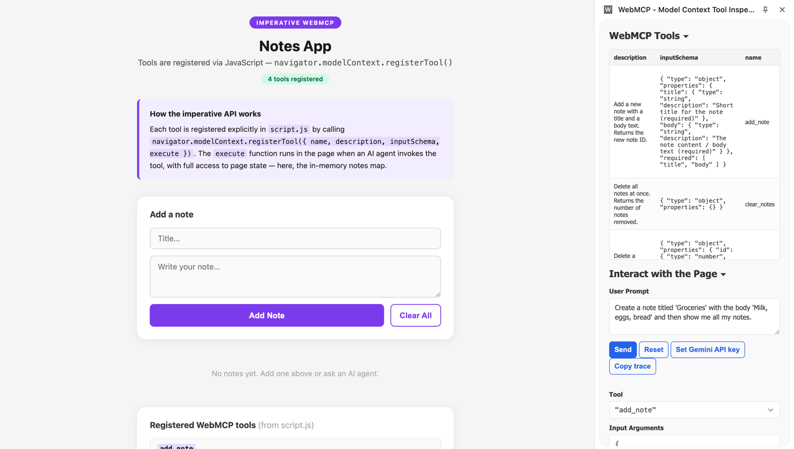
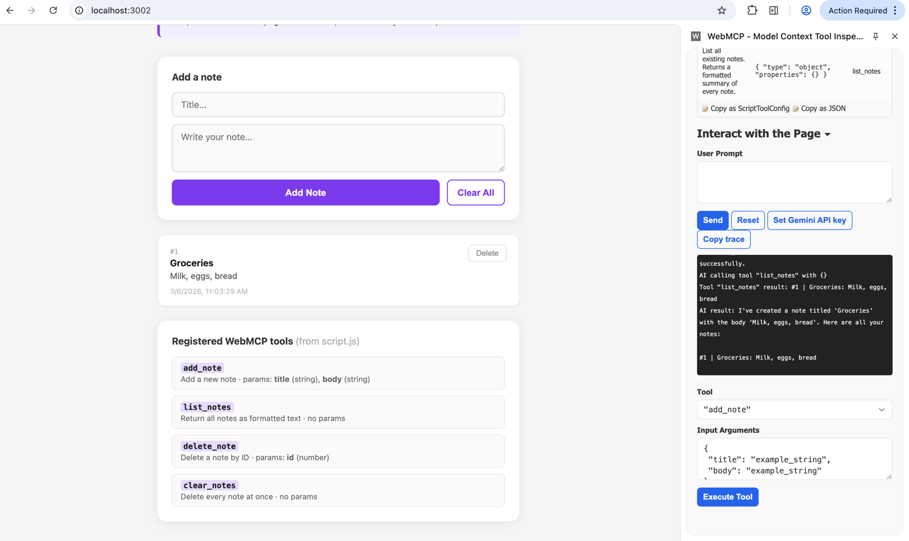

# webmcp-demo

A monorepo for exploring MCP and WebMCP concepts with simple, easy-to-understand demos.

---

## WebMCP

[WebMCP](https://developer.chrome.com/blog/webmcp-epp) is a browser-native API by Google/Chrome that makes web pages **agent-ready** — letting AI agents interact with your site through structured tools, without relying on raw DOM scraping.

Two styles are demonstrated here, each as a separate package.

---

## Structure

```
webmcp-demo/
└── packages/
    ├── declarative/    Feedback form   → tools defined via HTML attributes
    └── imperative/     Notes app       → tools registered via JavaScript
```

---

## Running

```bash
npm install
npm run dev              # starts both servers concurrently
```

Or run individually:

```bash
npm run dev:declarative  # http://localhost:3001
npm run dev:imperative   # http://localhost:3002
```

> **Requirement:** Use Chrome with the WebMCP flag enabled.
> Open `chrome://flags`, search for **WebMCP**, and enable it.

---

## Declarative — `packages/declarative` → `localhost:3001`

Tools are defined entirely through **HTML attributes** on a `<form>`. No JavaScript registration needed — the browser reads the attributes and exposes the tool to AI agents automatically.

### Attributes used

| Attribute | Where | Purpose |
|---|---|---|
| `toolname` | `<form>` | Unique tool identifier |
| `tooldescription` | `<form>` | What the tool does |
| `toolparamdescription` | `<input>` / `<select>` / `<textarea>` | What each parameter means |

### Example

```html
<form
  toolname="submit_product_feedback"
  tooldescription="Submit a product feedback entry with name, email, message, and rating."
>
  <input
    name="name"
    toolparamdescription="Customer full name (min 2 characters)"
  />
  <select
    name="rating"
    toolparamdescription="Numeric rating: 1 = Poor, 5 = Excellent"
  >
    ...
  </select>
</form>
```

### When to use

Best for standard, form-based actions where the input and output are straightforward. Low boilerplate — the HTML *is* the tool definition.

---

## Imperative — `packages/imperative` → `localhost:3002`

Tools are registered **programmatically in JavaScript** via `navigator.modelContext.registerTool()`. Each tool has an explicit `execute` function with full access to page state.

### API

```js
navigator.modelContext.registerTool({
  name: 'tool_name',
  description: 'Human-readable description of what the tool does.',
  inputSchema: {
    type: 'object',
    properties: {
      param: { type: 'string', description: 'What this param means' }
    },
    required: ['param']
  },
  execute: ({ param }) => {
    // full JS access — update UI, read state, call APIs…
    return 'Result string returned to the agent';
  }
});
```

### Tools registered in this demo

| Tool | Params | Description |
|---|---|---|
| `add_note` | `title`, `body` | Create a new note |
| `list_notes` | — | Return all notes as text |
| `delete_note` | `id` | Delete a note by ID |
| `clear_notes` | — | Delete all notes |

### When to use

Best for dynamic, stateful interactions — when tools need to read or modify in-page state, run conditional logic, or compose multiple operations.

---

## Declarative vs Imperative at a glance

| | Declarative | Imperative |
|---|---|---|
| Defined in | HTML attributes | JavaScript |
| JS required | No | Yes |
| Access to page state | No | Yes |
| Best for | Simple form submissions | Dynamic, stateful workflows |
| Boilerplate | Minimal | Explicit per tool |

## How to test this

1. Install **Chrome Canary** 
2. Go to chrome://flags/ and then enable the **WebMCP for testing**
3. Install extension - **WebMCP - Model Context Tool Inspection**
4. Set the Google API for the agent - at the time of testing it was still in development phase
   https://aistudio.google.com/api-keys and generate the API Key

## Testing samples





